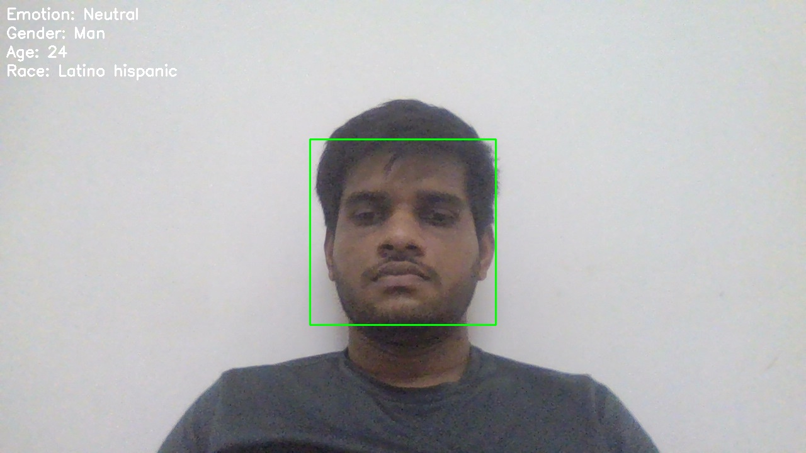
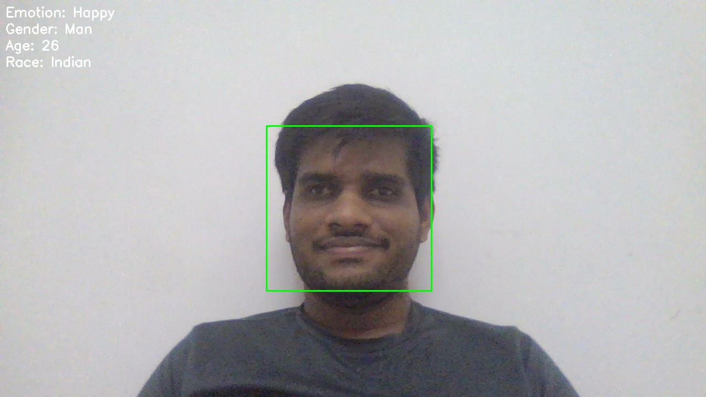
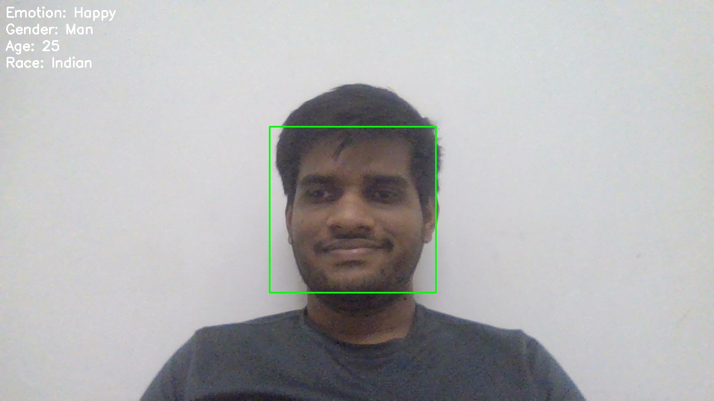
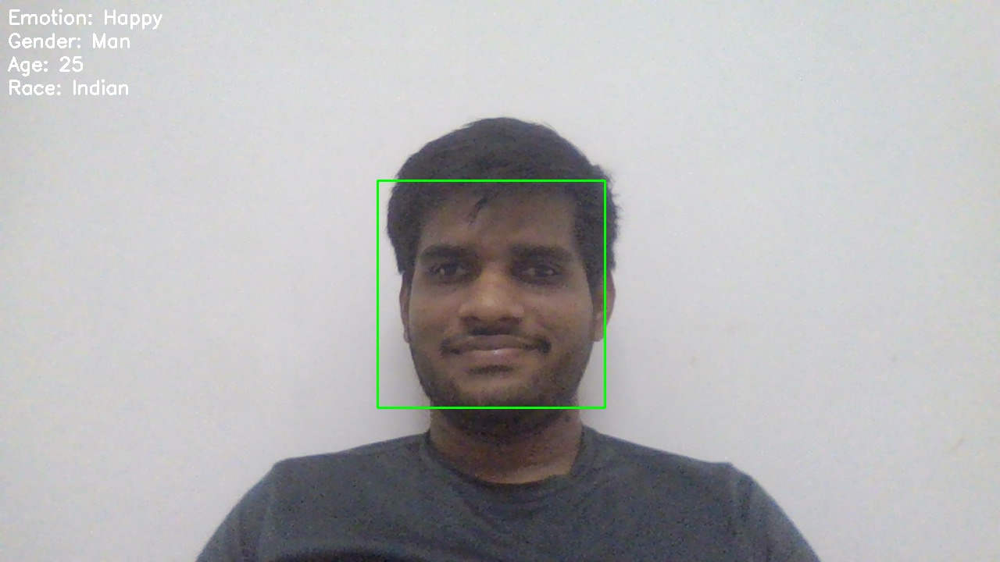

# Facial Emotion Recognition using DeepFace

## 📌 Overview

This project is a **real-time Facial Emotion Recognition** system built using **Python**, **OpenCV**, and **DeepFace**. The application captures live video from a webcam, detects faces, and analyzes facial attributes such as **emotion, age, gender, and race** in real time.

Additionally, users can capture and save images directly from the webcam for creating datasets or future model training.

---

## ✨ Features

* 🎥 Real-time webcam video capture
* 😊 Real-time facial emotion recognition
* 👤 Face detection using Haar Cascade Classifier
* 🧑 Age estimation
* 🚻 Gender prediction
* 🌍 Race prediction
* 📷 Capture and save images by pressing the **`c`** key
* 🖥️ Displays analysis results on the video feed
* ❌ Exit the application by pressing the **`q`** key

---

## 🛠️ Technologies Used

* Python 3.x
* OpenCV
* DeepFace
* NumPy

---

## 📁 Project Structure

```
Facial-Emotion-Recognition/
│
├── Facial-Emotion.py
├── haarcascade_frontalface_default.xml
├── Images/
│   ├── image_0.jpg
│   ├── image_1.jpg
│   └── ...
└── README.md
```

---

## 📦 Installation

### 1. Clone the repository

```bash
git clone https://github.com/Chetanlamani/Facial-Emotion-Recognition.git
```

### 2. Navigate to the project directory

```bash
cd Facial-Emotion-Recognition
```

### 3. Create a virtual environment (Optional)

**Windows**

```bash
python -m venv venv
venv\Scripts\activate
```

**Linux/macOS**

```bash
python3 -m venv venv
source venv/bin/activate
```

### 4. Install dependencies

```bash
pip install -r requirements.txt
```

Or install manually:

```bash
pip install opencv-python deepface numpy
```

---

## ▶️ Running the Project

Run the application using:

```bash
python Facial-Emotion.py
```

---

## 🎮 Controls

| Key   | Action                             |
| ----- | ---------------------------------- |
| **c** | Capture and save the current frame |
| **q** | Quit the application               |

Captured images are stored in the **Images/** directory.

---

## 🧠 How It Works

1. Opens the webcam using OpenCV.
2. Detects faces using a Haar Cascade classifier.
3. Extracts the first detected face.
4. Uses DeepFace to analyze:

   * Emotion
   * Age
   * Gender
   * Race
5. Displays the analysis on the video feed.
6. Allows users to save images for dataset creation by pressing **`c`**.

---

## 📸 Sample Output





---

## 🚀 Future Improvements

* Face recognition with identity matching
* Emotion history logging
* Automatic dataset collection
* Multiple face analysis
* FPS optimization
* Emotion-based attendance system
* GUI using Tkinter or PyQt
* Model comparison with MediaPipe or YOLO face detection

---

## 🤝 Contributing

Contributions are welcome!

1. Fork the repository.
2. Create a new feature branch.
3. Commit your changes.
4. Push the branch.
5. Open a Pull Request.

---

## 📄 License

This project is open-source and available under the MIT License.

---
